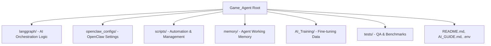

# Game Agent Project Manifest (Source & Config Snapshot)

This file provides a consolidated view of the project's source code and configuration, excluding heavy runtime environments and models.

## 📂 Project Structure Overview

## ⚙️ Critical Configuration Files
These files are essential for the system to run and are located in the following areas:

| File | Location | Purpose |
| :--- | :--- | :--- |
| **Main Config** | `~/.openclaw/openclaw.json` | Master configuration for the OpenClaw Gateway. |
| **MCP Config** | `openclaw_configs/mcp_config.json` | Defines tools and MCP server integrations. |
| **Agent Personas** | `openclaw_configs/agents/` | System prompts for CODER, COORDINATOR, etc. |
| **Environment** | `.env` | API keys, Model IDs, and context window limits. |
| **Dependencies** | `requirements.txt` | Python packages required for the project. |
| **Security** | `openclaw-security-checklist.md` | Audit checklist for public deployment. |

## 🛠️ Core Source Code Modules

### 1. LangGraph Nodes (`langgraph/nodes/`)
- `research_node.py`: Logic for deep research using external tools.
- `architect_node.py`: High-level system design and planning.
- `coder_warrior.py`: Code generation and implementation.
- `validation_warrior.py`: Quality assurance and testing.

### 2. Management Scripts (`scripts/`)
- `bootstrap_agent.py`: Initializer for the agent environment.
- `model_manager.py`: Handles local model selection and status.
- `task_manager.py`: orchestrates asynchronous task execution.
- `setup_env.sh`: Environment setup and dependency installer.

## 🛑 Excluded from Tracking
The following are **NOT** included in the Git repository due to size or sensitivity:
- `.venv*/`: Virtual environments (thousands of library files).
- `poc/`: Proof-of-concept projects.
- `memory/`: Local working memory and session logs.
- `data/` & `tests/`: Runtime data and testing artifacts.
- `*.txt`: Detailed API logs/raw docs (except `README.md`).
- `secrets/`: Private credentials.
- `chroma_db/`: Local vector database storage.
- `unsloth_compiled_cache/`: Heavy ML compilation artifacts.
